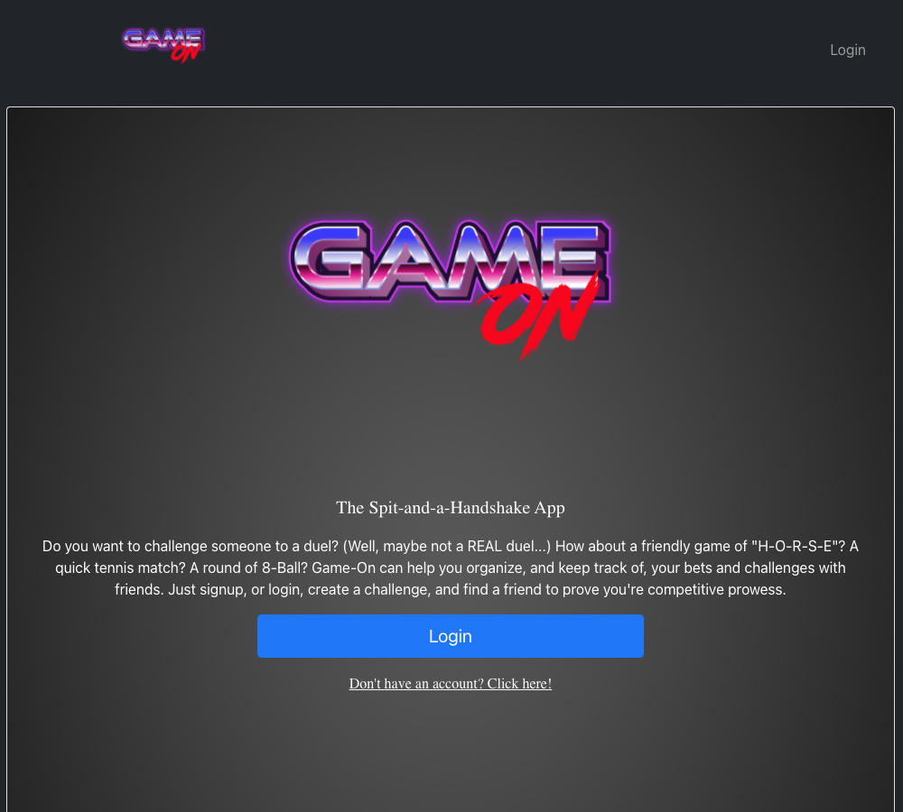
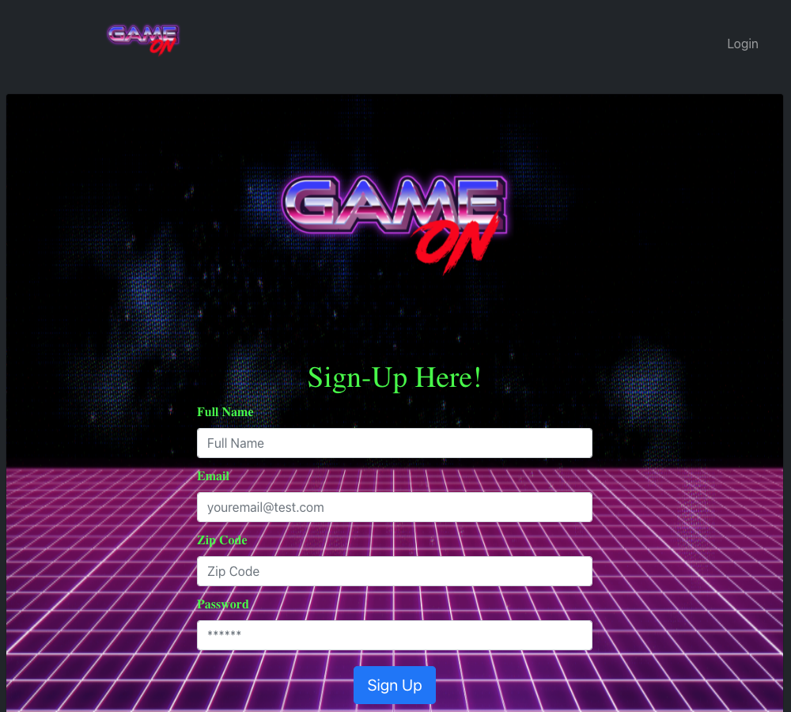
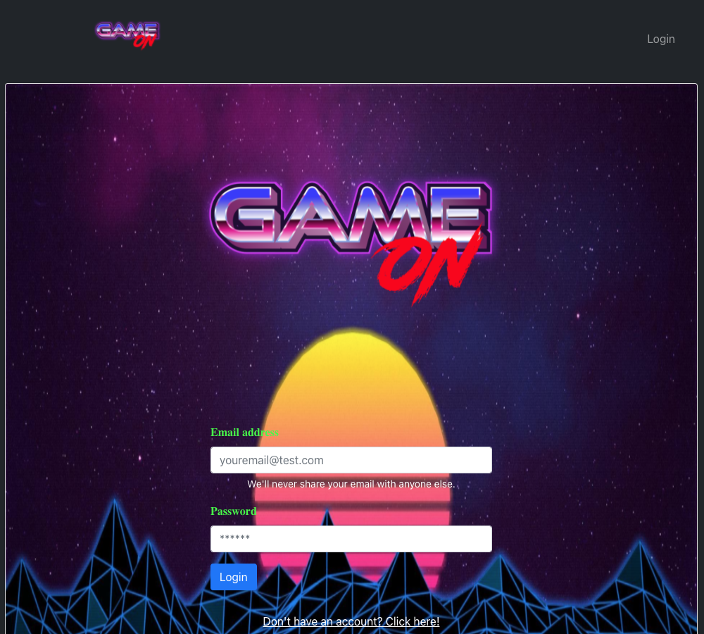
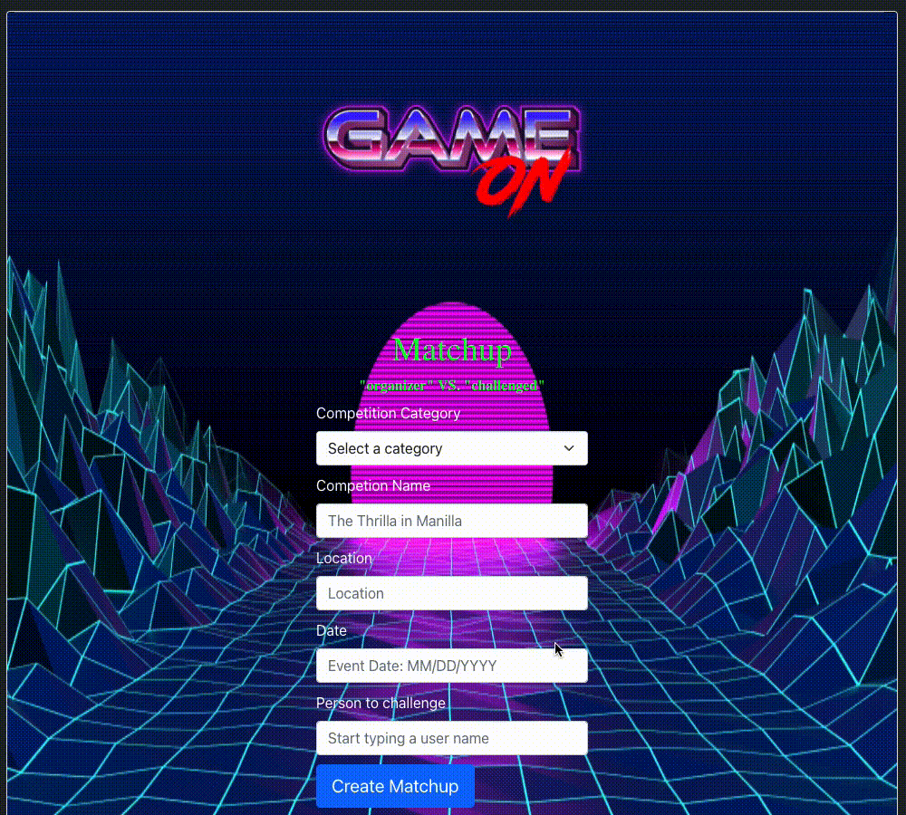
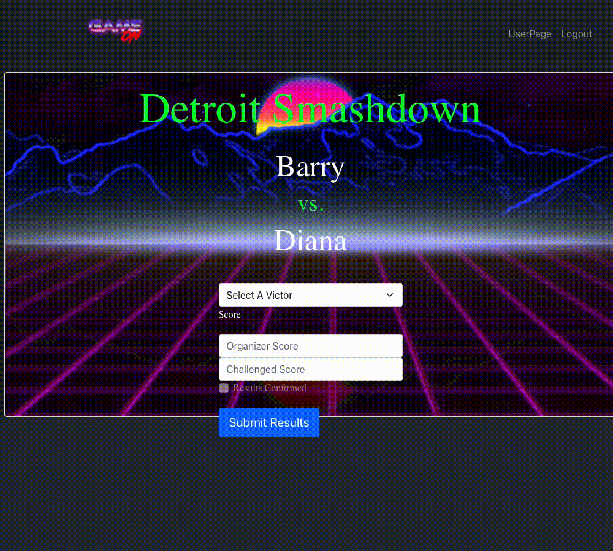
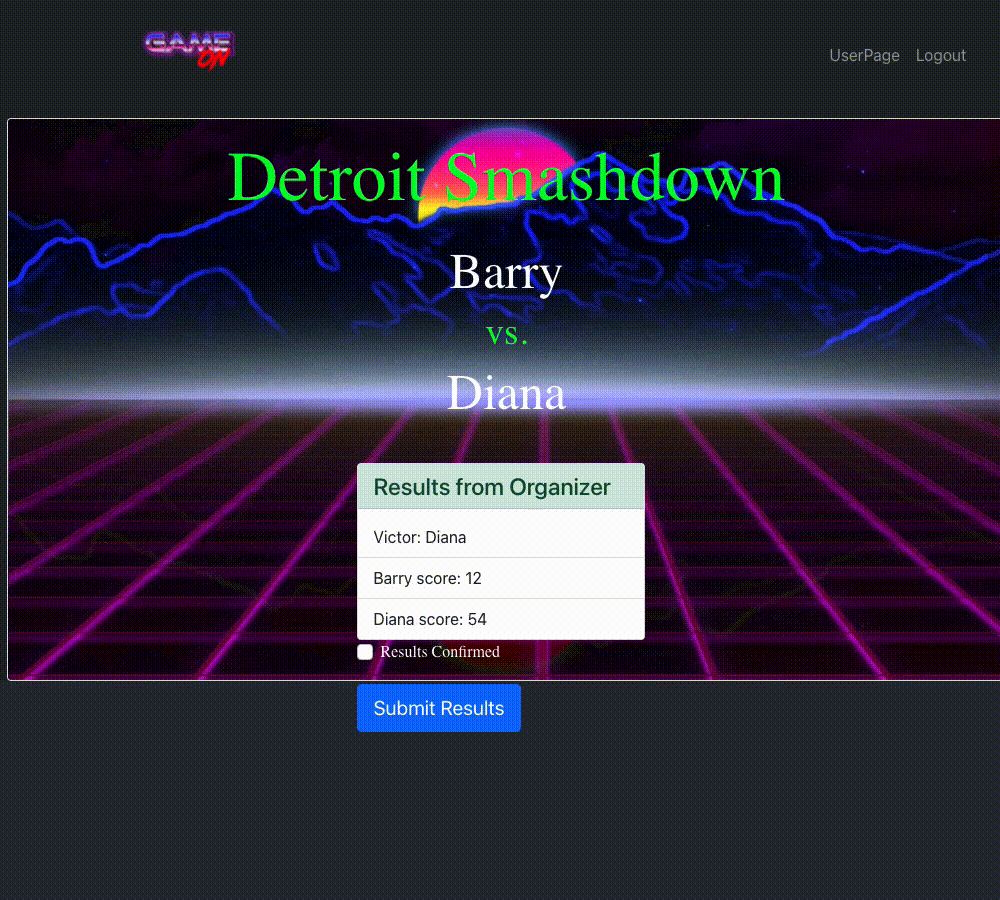

# Game-On

## Description

- Tasked with building a collaborative, Full-stack MERN appication, Game-ON, is an online "spit-and-handshake" sports competitive app. Using the Git branching workflow and Agile software development, our team was able to create React, MERN application allowing for user's to sign-up and login; giving them access to enter into competitions based on the categories, type of genre and location of a user. 
- The Organizer has the option to challenge an opppenent by searching for their Username, selecting a category from the drop down box and then given an option to make a "wager"; whether that be monetary or verbal.
- The user who is "challenged" has the option to reject or accept the competition.
- If in agreement, the organizer and opponent will be able to tally scores, post those stats, declare a victor, and then those stats will be reflected in the User Profile (as Wins, Losses and Ties).

## Table of Contents
  * [Installation](#installation)
  * [Usage](#usage)
  * [Screenshots](#screenshots)
  * [Credits](#credits)
  * [Collaborators](#collaborators)
  * [License](#license)

## Deployed Application
* [Game On](https://game-on-msu-2021.herokuapp.com/)

## Installation

- The app was built using MERN  methods and agile software development then deployed to Heroku.

## Usage

- The main page displays an input form for a username and password to login - If the user does not have an account, there is an OnClick button below directing to a Sign-up page.
- If signing up for a new account, the user is directed to a "Create Account" form. This requires their full name, email address, zip code (for competition match-up's), a unique password and an option for online payment should they decide to engage in a friendly, monetary wager. The user would include their Venmo, CashApp or Zelle Usernames for wager agreements. Again, a spit-and-handshake concept 
- Once the user clicks "Continue", they are presented with their main profile/dashboard. This includes their username, stats, matchup's, and the option to search for other opponents by username.
- Clicking the "Matchup" button in the upper left nav will allow the user to challenge an opponent of their choice (based on location) with another user. It is up to the challenged to accept or reject.
- If initial results of a match are not input, the Challenge will be left as "pending." If the results are accepted, the stats will then be displayed along with a wager. 
- The option to dispute the outcome of the competition is also available to the challenged opponent. 

## Screenshots

## Credits
This app uses the following libraries and modules: 

* Express
* Mongoose
* Express.Router
* graphQL
* Apollo Sandbox (for building queries and mutations)
* Compass for viewing the database
* MongoDB
* React.js
* React-Bootstrap

## Collaborators
* [Ian Hennessey](https://github.com/atleastitsanethosman)
* [Barry St. Pierre](https://github.com/bdstpierre)
* [Olja PriyaKovich](https://github.com/oljapriya)
* [Daniel Shoup](https://github.com/danshoup)
* [Diana Daghlas](https://github.com/ddaghlas)
* [Jamie Kuras](https://github.com/jkur16)

## License
Copyright 2021 Game-On

    Permission is hereby granted, free of charge, to any person obtaining a copy of this software and associated documentation files (the "Software"), to deal in the Software without restriction, including without limitation the rights to use, copy, modify, merge, publish, distribute, sublicense, and/or sell copies of the Software, and to permit persons to whom the Software is furnished to do so, subject to the following conditions:
    
    The above copyright notice and this permission notice shall be included in all copies or substantial portions of the Software.
    
    THE SOFTWARE IS PROVIDED "AS IS", WITHOUT WARRANTY OF ANY KIND, EXPRESS OR IMPLIED, INCLUDING BUT NOT LIMITED TO THE WARRANTIES OF MERCHANTABILITY, FITNESS FOR A PARTICULAR PURPOSE AND NONINFRINGEMENT. IN NO EVENT SHALL THE AUTHORS OR COPYRIGHT HOLDERS BE LIABLE FOR ANY CLAIM, DAMAGES OR OTHER LIABILITY, WHETHER IN AN ACTION OF CONTRACT, TORT OR OTHERWISE, ARISING FROM, OUT OF OR IN CONNECTION WITH THE SOFTWARE OR THE USE OR OTHER DEALINGS IN THE SOFTWARE.
